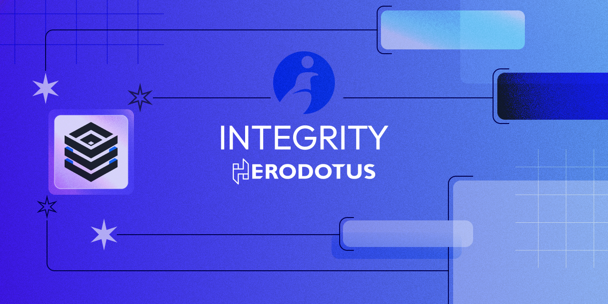

# Cairo Verifier



[](https://github.com/HerodotusDev/cairo-verifier/actions/workflows/tests.yml)

[](https://github.com/HerodotusDev/cairo-verifier/actions/workflows/proof_verification_tests.yml)

## Table of contents

-   [Prerequisites](#prerequisites)
-   [Using Verifier contracts on Starknet](#using-verifier-contracts-on-starknet)
-   [Running locally](#running-locally)
-   [Creating a Proof](#creating-a-proof)
-   [Deployment](#deployment)
-   [Split Verifier Architecture](#split-verifier-architecture)

## Prerequisites

To use the verifier with contracts deployed on Starknet, you need to have [Rust](https://www.rust-lang.org/tools/install) and [Starknet Foundry](https://foundry-rs.github.io/starknet-foundry/getting-started/installation.html) installed. Also make sure to update [snfoundry.toml](./snfoundry.toml) file with appropriate `account` name and RPC `url`.

For running locally and development, you will need [scarb](https://docs.swmansion.com/scarb/) (we recommend using [asdf](https://asdf-vm.com/) version manager).

### Getting example proofs

Because of large size of proofs, we don't store example proofs directly in this repository, but rather in [Large File Storage](https://git-lfs.com/), so you need to have it installed and then run `git lfs pull` to get all example proofs.

## Using Verifier contracts on Starknet

Integrity verifier is deployed on Starknet and can be used for verifying proofs onchain. The intended way of using the verifier is through FactRegistry contract, which besides running the verification process, also stores data for all verified proofs. (For more information see [FactRegistry and Proxy contract](#factregistry-and-proxy-contract))

There are two ways of serializing proof into calldata: monolith and split proof. The former should be used if possible, because it's easier and more efficient. The latter should only be used if monolith proof did not fit in a single transaction, either because of calldata limit or steps limit.

### Monolith proof

Calldata for monolith proof can be generated with the following command:

```bash
cargo run --release --bin proof_serializer < examples/proofs/recursive/cairo0_stone5_keccak_160_lsb_example_proof.json > examples/calldata
```

After that, you can use `verify-on-starknet.sh` script to send the transaction to FactRegistry contract. Remember to select appropriate settings for your proof. For more information on supported settings, see [Configure Verifier](#configure-verifier).

For example, run:

```bash
./verify-on-starknet.sh 0x16409cfef9b6c3e6002133b61c59d09484594b37b8e4daef7dcba5495a0ef1a examples/calldata recursive keccak_248_lsb stone5 cairo0
```

This bash script internally calls `verify_proof_full_and_register_fact` function on FactRegistry contract.

### Split proof

To generate split calldata, please refer to [Calldata Generator README](https://github.com/HerodotusDev/integrity-calldata-generator/blob/main/README.md). This repository also provides script for automatic transaction sending (proof verification is split into multiple transactions, for more information see [Split Verifier Architecture](#split-verifier-architecture)).

## Running locally

To run the verifier locally, first you need to build cairo project using:

```bash
scarb build
```

The verifier by default is configured in recursive layout and keccak hasher. If you want to build for other layouts, refer to [Configure Verifier](#configure-verifier)

### Running the Verifier on Example Proof

You can use cairo runner to run the verifier on example proof:

```bash
cargo run --release --bin runner -- \
--program target/dev/integrity.sierra.json \
--cairo-version cairo0 \
--stone-version stone5 \
--hasher-bit-length 160_lsb \
< examples/proofs/recursive/cairo0_stone5_keccak_160_lsb_example_proof.json
```

### Configure Verifier

By default, the verifier is configured for monolith version, recursive layout and keccak hash for verifier unfriendly commitment layers. You can easily change that by using scarb's features:

```bash
scarb build --no-default-features --features small,blake2s,monolith
```

`layout`: [`dex`, `recursive`, `recursive_with_poseidon`, `small`, `starknet`, `starknet_with_keccak`]<br />
hash functions: [`keccak`, `blake2s`]<br />
verifier types: [`monolith`, `split`]

There are also additional settings that can be configured at runtime:

`cairo_version`: [`cairo0`, `cairo1`]<br />
`stone_version`: [`stone5`, `stone6`]<br />
hasher bit length: [`160_lsb`, `248_lsb`]

Hash function and hasher bit length are combined into one setting:

`hasher`: [`keccak_160_lsb`, `blake2s_160`, `blake2s_248_lsb`]

For `stone5` available `hasher`s are `keccak_160_lsb` and `blake2s_160`, for `stone6` - `keccak_160_lsb` and `blake2s_248_lsb`.

### Running tests

To run tests, use the following command:

```bash
scarb test
```

### Benchmarking

In order to launch benchmarking, just run this (it requires recursive layout configuration):

```bash
cargo run --release --bin benches -- target/dev/integrity.sierra.json
```

## Creating a Proof

### Stone Prover Instructions

For detailed instructions and examples, refer to the Stone Prover [documentation](https://github.com/starkware-libs/stone-prover?tab=readme-ov-file#overview).

How to prove [Cairo0](https://github.com/starkware-libs/stone-prover?tab=readme-ov-file#creating-and-verifying-a-proof-of-a-cairozero-program) program with Stone Prover.

How to prove [Cairo1](https://github.com/starkware-libs/stone-prover?tab=readme-ov-file#creating-and-verifying-a-proof-of-a-cairo-program) program with Stone Prover.

## Deployment

If you want to deploy the verifier yourself, please follow these steps:

1. Deploy FactRegistry contract

```bash
bash deployment/fact_registry/deploy.sh
```

2. (optional) Deploy Proxy contract

```bash
bash deployment/proxy/deploy.sh
bash deployment/proxy/set_fact_registry.sh
```

3. Deploy and register Verifier contracts

Make sure to replace `<layout>` and `<hasher>` with appropriate names.

```bash
sncast multicall run --fee-token eth --path deployment/verifiers/<layout>/<hasher>/deploy.toml
bash deployment/verifiers/<layout>/<hasher>/register.sh
```

## Split Verifier Architecture

### Background information

Because of great complexity of the verifier compared to standard starknet contracts, we encounter some limitations enforced by starknet. The most important ones are:

-   Contract classhash size limit
-   Transaction calldata limit
-   Transaction steps limit

To overcome these limitations, we split the verifier into multiple contracts and transactions. The biggest part of classhash size is autogenerated (e.g. [recursive autogenerated](/src/air/layouts/recursive/autogenerated.cairo)), so we extracted that part into separate contract (or many contracts in case of `starknet_with_keccak` layout), which is called automatically by the main verifier contract. On the other hand the biggest part of calldata is fri witness, so user can send subsequent chunks of fri witness in separate step transactions.

### FactRegistry and Proxy contract

Since verifier can be configured in many ways and some parts of the logic changes with new stone versions, a contract which routes calls to the correct verifier is needed. This task is handled by FactRegistry contract that also stores data for all verified proofs.

After proof is verified, `FactRegistered` event is emitted which contains `fact_hash`, `verification_hash`, `security_bits` and `settings`. `fact_hash` is a value that represents proven program and its output (formally `fact_hash = poseidon_hash(program_hash, output_hash)`). Remember that registration of some `fact_hash` doesn't necessary mean that it has been verified by someone with secure enough proof. You always need to check `security_bits` and `settings` which is part of `verification_hash` (formally `verification_hash = poseidon_hash(fact_hash, security_bits, settings)`).

`FactRegistry` provides two methods for checking verified proofs:

-   `get_verification(verification_hash)` - returns fact hash, security bits and settings for given `verification_hash`.
-   `get_all_verifications_for_fact_hash(fact_hash)` - returns list of all verification hashes, security bits and settings for given `fact_hash`. This method is useful for checking if given program has been verified by someone with secure enough proof.

FactRegistry contract is trustless which means that the owner of the contract can't override or change any existing behavior, they can only add new verifiers. Proxy contract on the other hand is upgradable, so every function can be changed or removed. It has the advantage of having all future updates of the verifier logic without having to replace the address of FactRegistry contract.

TODO: how to read FactRegistered event
